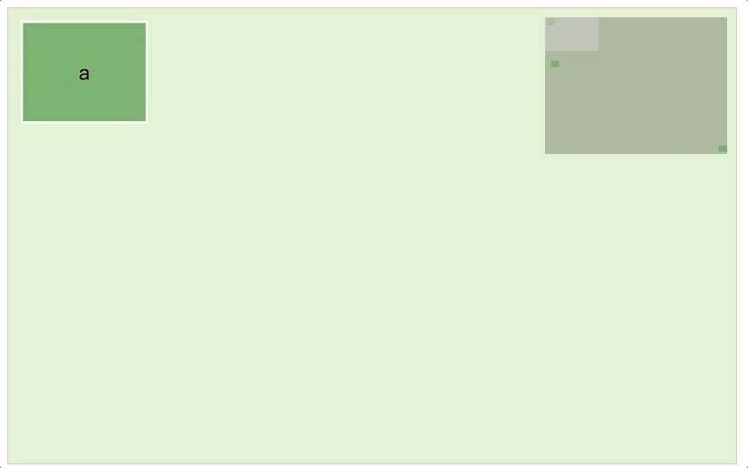

# vue-miniview

## 依赖
```
index.html

<script src="<%= BASE_URL %>js/jquery-1.9.1.min.js"></script>
<script src="http://apps.bdimg.com/libs/jqueryui/1.10.4/jquery-ui.min.js"></script>
<script src="<%= BASE_URL %>js/jquery.mousewheel.js"></script>

```

## 安装

```
npm i liangwenle/vue-miniview
```

## 使用
```
import Vue from 'vue'
import Miniview from 'vue-miniview/components/Miniview'

Vue.component('Miniview', Miniview)

```

```
<Miniview msg="ok">
    <div slot-scope="slotProps">
        
        <div 
            v-for="(node,index) in nodes" 
            :key="index" 
            :id="`node_${index}`" 
            class="node" 
            :style="`top:${node.top}px;left:${node.left}px`">
            {{node.title}}
        </div>

    </div>
</Miniview>

```


